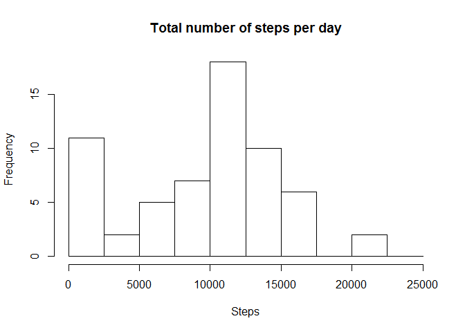
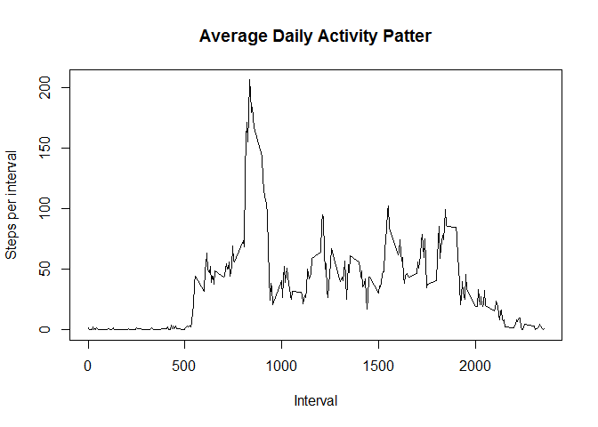

# Reproducible Research: Peer Assessment 1


## Loading and preprocessing the data


```r
        act <- read.csv (unz("~/GitHub/RepData_PeerAssessment1/activity.zip", "activity.csv"), stringsAsFactors = FALSE)
        act$date <- as.Date(act$date)
        act1 <- act
        library(dplyr)
```

```
## 
## Attaching package: 'dplyr'
```

```
## The following objects are masked from 'package:stats':
## 
##     filter, lag
```

```
## The following objects are masked from 'package:base':
## 
##     intersect, setdiff, setequal, union
```

### Histogram of the total number of steps per day
The histogram below shows the total number of steps per day.  Many days show no activity.

```r
        totstep <- sapply(split(act1$steps, act1$date), sum, na.rm=TRUE)
        hist(totstep, breaks = c(0,2500,5000,7500,10000,12500,15000,17500,20000,22500,25000), 
     main ="Total number of steps per day", xlab = "Steps")
```


        
## What is mean total number of steps taken per day?

```r
      meanstep <- sapply(split(act1$steps, act1$date), mean, na.rm=TRUE)
        medstep <- sapply(split(act1$steps, act1$date), median, na.rm=TRUE)
```

###The Mean number of steps per day is 

```r
        meanstep
```

```
## 2012-10-01 2012-10-02 2012-10-03 2012-10-04 2012-10-05 2012-10-06 
##        NaN  0.4375000 39.4166667 42.0694444 46.1597222 53.5416667 
## 2012-10-07 2012-10-08 2012-10-09 2012-10-10 2012-10-11 2012-10-12 
## 38.2465278        NaN 44.4826389 34.3750000 35.7777778 60.3541667 
## 2012-10-13 2012-10-14 2012-10-15 2012-10-16 2012-10-17 2012-10-18 
## 43.1458333 52.4236111 35.2048611 52.3750000 46.7083333 34.9166667 
## 2012-10-19 2012-10-20 2012-10-21 2012-10-22 2012-10-23 2012-10-24 
## 41.0729167 36.0937500 30.6284722 46.7361111 30.9652778 29.0104167 
## 2012-10-25 2012-10-26 2012-10-27 2012-10-28 2012-10-29 2012-10-30 
##  8.6527778 23.5347222 35.1354167 39.7847222 17.4236111 34.0937500 
## 2012-10-31 2012-11-01 2012-11-02 2012-11-03 2012-11-04 2012-11-05 
## 53.5208333        NaN 36.8055556 36.7048611        NaN 36.2465278 
## 2012-11-06 2012-11-07 2012-11-08 2012-11-09 2012-11-10 2012-11-11 
## 28.9375000 44.7326389 11.1770833        NaN        NaN 43.7777778 
## 2012-11-12 2012-11-13 2012-11-14 2012-11-15 2012-11-16 2012-11-17 
## 37.3784722 25.4722222        NaN  0.1423611 18.8923611 49.7881944 
## 2012-11-18 2012-11-19 2012-11-20 2012-11-21 2012-11-22 2012-11-23 
## 52.4652778 30.6979167 15.5277778 44.3993056 70.9270833 73.5902778 
## 2012-11-24 2012-11-25 2012-11-26 2012-11-27 2012-11-28 2012-11-29 
## 50.2708333 41.0902778 38.7569444 47.3819444 35.3576389 24.4687500 
## 2012-11-30 
##        NaN
```
###The median number of steps per day is

```r
        medstep
```

```
## 2012-10-01 2012-10-02 2012-10-03 2012-10-04 2012-10-05 2012-10-06 
##         NA          0          0          0          0          0 
## 2012-10-07 2012-10-08 2012-10-09 2012-10-10 2012-10-11 2012-10-12 
##          0         NA          0          0          0          0 
## 2012-10-13 2012-10-14 2012-10-15 2012-10-16 2012-10-17 2012-10-18 
##          0          0          0          0          0          0 
## 2012-10-19 2012-10-20 2012-10-21 2012-10-22 2012-10-23 2012-10-24 
##          0          0          0          0          0          0 
## 2012-10-25 2012-10-26 2012-10-27 2012-10-28 2012-10-29 2012-10-30 
##          0          0          0          0          0          0 
## 2012-10-31 2012-11-01 2012-11-02 2012-11-03 2012-11-04 2012-11-05 
##          0         NA          0          0         NA          0 
## 2012-11-06 2012-11-07 2012-11-08 2012-11-09 2012-11-10 2012-11-11 
##          0          0          0         NA         NA          0 
## 2012-11-12 2012-11-13 2012-11-14 2012-11-15 2012-11-16 2012-11-17 
##          0          0         NA          0          0          0 
## 2012-11-18 2012-11-19 2012-11-20 2012-11-21 2012-11-22 2012-11-23 
##          0          0          0          0          0          0 
## 2012-11-24 2012-11-25 2012-11-26 2012-11-27 2012-11-28 2012-11-29 
##          0          0          0          0          0          0 
## 2012-11-30 
##         NA
```
## What is the average daily activity pattern?

Below is a time series plot of the 5-minute interval (x-axis) and the average number of steps taken, averaged across all days (y-axis)
        

```r
        intsteps <- tapply(act1$steps, act1$interval, mean, na.rm=TRUE)
        timser <- data.frame(interval = as.numeric(names(intsteps)), average = intsteps)
        plot(timser$interval, timser$average, type="l", main="Average Daily Activity Patter", xlab="Interval", ylab="Steps per interval")
```


The  5-minute interval, on average across all the days in the dataset, that contains the maximum number of steps and the number of steps is:

```r
        ## interval with max number of steps
t <- which.max(intsteps)
intsteps[t]
```

```
##      835 
## 206.1698
```

## Imputing missing values
The original value is moved from long to wide with dcast.  This facilitates calculating the mean for each interval and replace the mean per interval in areas where data is not available(NA).

```r
        library(reshape2)
        ## dcast data.frame from long to wide using interval as column names
        act2 <- dcast(act1, date~interval, value.var="steps")
        ## find the mean for each columna and replace NAs with column(interval) mean
        for (i in 2:289) {
        act2[,i][which(is.na(act2[,i]))] <- mean(act2[,i], na.rm=TRUE)
}
```


## Are there differences in activity patterns between weekdays and weekends?

```r
        act4 <- mutate(act2, weekday = weekdays(date))
        #create a vector of weekdays
                weekdays1 <- c('Monday', 'Tuesday', 'Wednesday', 'Thursday', 'Friday')
#Use `%in%` and `weekdays` to create a logical vector
#convert to `factor` and specify the `levels/labels`
        act4$wDay <- factor((act4$weekday %in% weekdays1), levels=c(FALSE, TRUE), labels=c('weekend', 'weekday'))
# calculate mean number of steps foreach interval and place in data fram
        totstep1 <- sapply(split(act4[,2:289], act4$wDay), colMeans)
        totstep1 <- as.data.frame(totstep1)
        totstep1 <- mutate(totstep1, interval=row.names(totstep1))
        totstep2 <- melt(totstep1, id.vars = "interval", measure.vars = c("weekend", "weekday"))
# create plots with named variables, values
        library(lattice)
        names(totstep2) <- c("interval","weekday", "steps") 
        totstep2$interval <- as.numeric(totstep2$interval)
        xyplot(steps~interval|weekday, type="l", data=totstep2, layout=c(1,2))
```


                    
